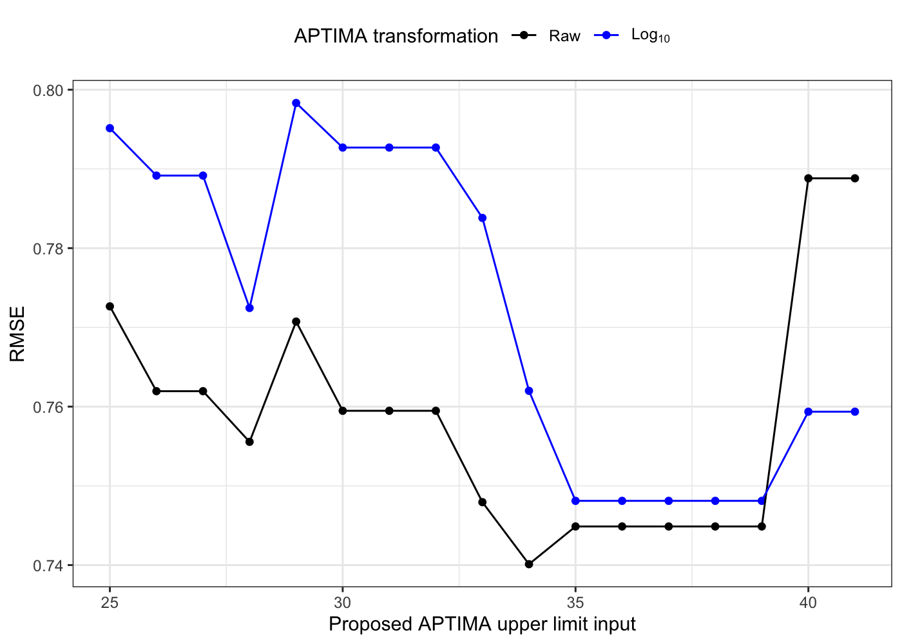
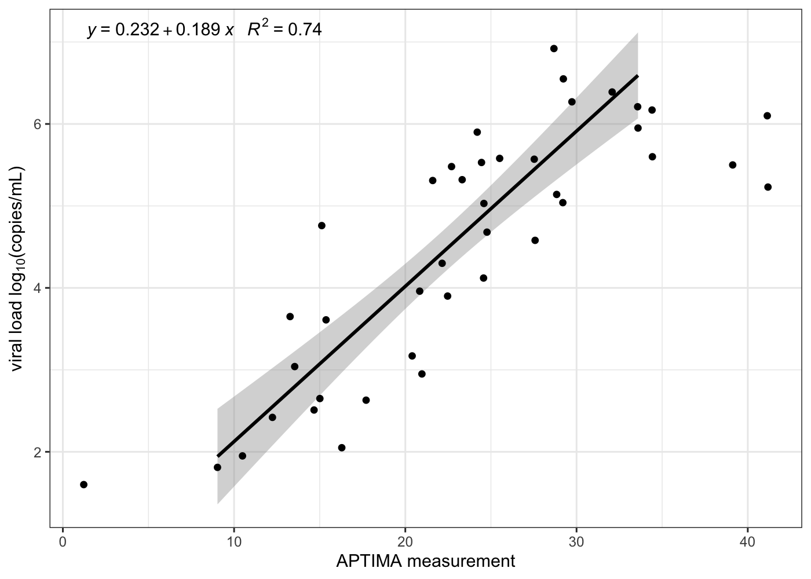

<!---
Creation Date: 10/1/2019
Creation Author: Bryan Mayer
--->


# Setup


```r
suppressPackageStartupMessages({
  library(tidyverse)
  library(kableExtra)
})

theme_set(theme_bw())

rv217 = read_csv("../../data/RV217Clean.csv")  %>%
  subset(ID != 40320) # only one data point and no APTIMA info
```

```
## Parsed with column specification:
## cols(
##   .default = col_double(),
##   draw_date = col_character(),
##   VLunit = col_character(),
##   posVL = col_logical(),
##   primary_kinetics = col_logical(),
##   APTIMA = col_character(),
##   VL_site = col_character(),
##   FiebigStage = col_character(),
##   priority = col_character(),
##   site = col_character(),
##   Notes = col_character(),
##   visit_code = col_character(),
##   EIA = col_character(),
##   WB = col_character(),
##   arv_note = col_logical(),
##   any_arv = col_logical()
## )
```

```
## See spec(...) for full column specifications.
```


# APTIMA diagnosis


```r
rv217 %>%
  subset(days_dx == 0) %>%
  mutate(
    APTIMA_levels = case_when(
      is.na(APTIMA) ~ "Missing APTIMA",
      !is.na(APTIMA_num) ~ "Numerical measurement",
      is.na(suppressWarnings(as.numeric(APTIMA))) ~ APTIMA
    )
    ) %>%
  group_by(APTIMA_levels) %>%
  summarize(
    N = n(),
    Total_Obs_VL = sum(!is.na(log10VL))
  ) %>%
  arrange(desc(N)) %>%
  janitor::adorn_totals() %>%
  kable(caption = "APTIMA Reading Output at APTIMA Diagnosis") %>%
  kable_styling(full_width = F)
```

<table class="table" style="width: auto !important; margin-left: auto; margin-right: auto;">
<caption>APTIMA Reading Output at APTIMA Diagnosis</caption>
 <thead>
  <tr>
   <th style="text-align:left;"> APTIMA_levels </th>
   <th style="text-align:right;"> N </th>
   <th style="text-align:right;"> Total_Obs_VL </th>
  </tr>
 </thead>
<tbody>
  <tr>
   <td style="text-align:left;"> Numerical measurement </td>
   <td style="text-align:right;"> 43 </td>
   <td style="text-align:right;"> 6 </td>
  </tr>
  <tr>
   <td style="text-align:left;"> R </td>
   <td style="text-align:right;"> 7 </td>
   <td style="text-align:right;"> 0 </td>
  </tr>
  <tr>
   <td style="text-align:left;"> Missing APTIMA </td>
   <td style="text-align:right;"> 2 </td>
   <td style="text-align:right;"> 2 </td>
  </tr>
  <tr>
   <td style="text-align:left;"> NR </td>
   <td style="text-align:right;"> 1 </td>
   <td style="text-align:right;"> 1 </td>
  </tr>
  <tr>
   <td style="text-align:left;"> R/NR </td>
   <td style="text-align:right;"> 1 </td>
   <td style="text-align:right;"> 0 </td>
  </tr>
  <tr>
   <td style="text-align:left;"> Total </td>
   <td style="text-align:right;"> 54 </td>
   <td style="text-align:right;"> 9 </td>
  </tr>
</tbody>
</table>


```r
pl1 = rv217 %>%
  subset(days_dx == 0 & !is.na(APTIMA_num)) %>%
  mutate(VL_obs = !is.na(log10VL)) %>%
  ggplot(aes(x = APTIMA_num)) +
  #geom_histogram(bins = 15) + 
  geom_histogram(bins = 15, aes(fill = factor(VL_obs))) +
  scale_x_continuous("APTIMA measurement at APTIMA diagnosis") + 
  theme(legend.position = "top") +
  annotate("text", x = 0, y = Inf, label = "6/43 have VL measurement", hjust = 0.1, vjust = 1.1) +
  coord_cartesian(xlim = c(-2, 35)) +
  labs(fill = "VL observed at APTIMA dx")
  
pl2 = rv217 %>%
  subset(days_dx == 0 & !is.na(log10VL)& !is.na(APTIMA_num)) %>%
  ggplot(aes(y = log10VL, x = APTIMA_num)) +
  geom_point() +
  scale_x_continuous("APTIMA measurement at APTIMA diagnosis") +
  coord_cartesian(xlim = c(-2, 35)) +
  scale_y_continuous("Observed log10 VL at APTIMA diagnosis")

cowplot::plot_grid(pl1, pl2, align = "v", nrow = 2)
```

<!-- -->

# APTIMA vs. VL

## Overall

Moderate correlation (repeated measures adjusted) between APTIMA and log10 viral load; that is higher with log10 APTIMA.


```r
cor_apt_vl = rv217 %>%
  select(ID, VL, log10VL, APTIMA_num) %>%
  na.omit() %>% # complete case subsetting but not actually necessary
  mutate(ID = factor(ID), log10_APTIMA = log10(APTIMA_num)) %>%
  gather(vl_trans, vl, VL, log10VL) %>%
  gather(aptima_trans, aptima, APTIMA_num, log10_APTIMA) %>%
  group_by(vl_trans, aptima_trans) %>%
  nest() %>%
  mutate(
    rmcorr_mod = map(data, ~rmcorr::rmcorr(ID, vl, aptima, .x)),
    rmcorr_res = map(rmcorr_mod, ~tibble(r = .x$r, pvalue = .x$p, CI_lower = .x$CI[1], CI_upper = .x$CI[2]))
    ) %>%
  unnest(rmcorr_res)

cor_apt_vl %>%
  ungroup() %>%
  mutate_if(is.numeric, round, 3) %>%
  mutate(Correlation_95CI = paste0(r, " (", CI_lower, ", ", CI_upper,")")) %>%
  select(vl_trans, aptima_trans, Correlation_95CI, pvalue) %>%
  mutate(
    vl_trans = if_else(vl_trans == "VL", "Raw", "log10"),
    aptima_trans = if_else(aptima_trans == "APTIMA_num", "Raw", "log10")    
    ) %>%
  arrange(vl_trans)  %>%
  kable(caption = "Correlation between APTIMA and VL overall") %>%
  kable_styling(full_width = F)
```

<table class="table" style="width: auto !important; margin-left: auto; margin-right: auto;">
<caption>Correlation between APTIMA and VL overall</caption>
 <thead>
  <tr>
   <th style="text-align:left;"> vl_trans </th>
   <th style="text-align:left;"> aptima_trans </th>
   <th style="text-align:left;"> Correlation_95CI </th>
   <th style="text-align:right;"> pvalue </th>
  </tr>
 </thead>
<tbody>
  <tr>
   <td style="text-align:left;"> log10 </td>
   <td style="text-align:left;"> Raw </td>
   <td style="text-align:left;"> 0.367 (0.259, 0.467) </td>
   <td style="text-align:right;"> 0.000 </td>
  </tr>
  <tr>
   <td style="text-align:left;"> log10 </td>
   <td style="text-align:left;"> log10 </td>
   <td style="text-align:left;"> 0.404 (0.299, 0.5) </td>
   <td style="text-align:right;"> 0.000 </td>
  </tr>
  <tr>
   <td style="text-align:left;"> Raw </td>
   <td style="text-align:left;"> Raw </td>
   <td style="text-align:left;"> 0.002 (-0.118, 0.122) </td>
   <td style="text-align:right;"> 0.970 </td>
  </tr>
  <tr>
   <td style="text-align:left;"> Raw </td>
   <td style="text-align:left;"> log10 </td>
   <td style="text-align:left;"> 0.018 (-0.102, 0.137) </td>
   <td style="text-align:right;"> 0.771 </td>
  </tr>
</tbody>
</table>

```r
rv217 %>%
  subset(!is.na(log10VL) & !is.na(APTIMA_num)) %>%
  ggplot(aes(y = VL, x = APTIMA_num)) +
  geom_point() +
  scale_y_log10("VL") +
  scale_x_log10("APTIMA") +
  annotate("text", x = Inf, y = Inf, label = paste0("pho = ", round(cor_apt_vl$r[4], 3)),
    vjust = 1.1,
    hjust = 1.1
  )
```

<!-- -->

## At first positive VL

Correlation is even higher at first positive viral load (when removing the participant with APTIMA = 3). Visually, the correlation worsens when APTIMA > 30.


```r
# spearman is transform invariant

cor_apt_vl_1stpos = rv217 %>%
  subset(days == 0 & APTIMA_num > 3) %>%
  select(ID, VL, log10VL, APTIMA_num) %>%
  na.omit() %>% # complete case subsetting but not actually necessary
  mutate(
    ID = factor(ID), 
    log10_APTIMA = log10(APTIMA_num),
    spearman_cor = cor(APTIMA_num, VL, method = "spearman", use = "complete.obs"),
    spearman_p = coin::pvalue(coin::spearman_test(APTIMA_num ~ VL))
    ) %>%
  gather(vl_trans, vl, VL, log10VL) %>%
  gather(aptima_trans, aptima, APTIMA_num, log10_APTIMA) %>%
  group_by(vl_trans, aptima_trans, spearman_cor, spearman_p) %>%
  summarize(
    pearson_cor = cor(aptima, vl, use = "complete.obs"),
    pearson_p = cor.test(aptima, vl)$p.value
    )

cor_apt_vl_1stpos %>%
  ungroup() %>%
  mutate_if(is.numeric, round, 3) %>%
  select(vl_trans, aptima_trans, everything()) %>%
  mutate(
    vl_trans = if_else(vl_trans == "VL", "Raw", "log10"),
    aptima_trans = if_else(aptima_trans == "APTIMA_num", "Raw", "log10")    
    ) %>%
  arrange(vl_trans)  %>%
  kable(caption = "Correlation between APTIMA and VL at first positive VL (APTIMA > 5)") %>%
  kable_styling(full_width = F) %>%
  collapse_rows(3:4)
```

<table class="table" style="width: auto !important; margin-left: auto; margin-right: auto;">
<caption>Correlation between APTIMA and VL at first positive VL (APTIMA &gt; 5)</caption>
 <thead>
  <tr>
   <th style="text-align:left;"> vl_trans </th>
   <th style="text-align:left;"> aptima_trans </th>
   <th style="text-align:right;"> spearman_cor </th>
   <th style="text-align:right;"> spearman_p </th>
   <th style="text-align:right;"> pearson_cor </th>
   <th style="text-align:right;"> pearson_p </th>
  </tr>
 </thead>
<tbody>
  <tr>
   <td style="text-align:left;"> log10 </td>
   <td style="text-align:left;"> Raw </td>
   <td style="text-align:right;vertical-align: middle !important;" rowspan="4"> 0.83 </td>
   <td style="text-align:right;vertical-align: middle !important;" rowspan="4"> 0 </td>
   <td style="text-align:right;"> 0.805 </td>
   <td style="text-align:right;"> 0.000 </td>
  </tr>
  <tr>
   <td style="text-align:left;"> log10 </td>
   <td style="text-align:left;"> log10 </td>
   
   
   <td style="text-align:right;"> 0.840 </td>
   <td style="text-align:right;"> 0.000 </td>
  </tr>
  <tr>
   <td style="text-align:left;"> Raw </td>
   <td style="text-align:left;"> Raw </td>
   
   
   <td style="text-align:right;"> 0.336 </td>
   <td style="text-align:right;"> 0.034 </td>
  </tr>
  <tr>
   <td style="text-align:left;"> Raw </td>
   <td style="text-align:left;"> log10 </td>
   
   
   <td style="text-align:right;"> 0.340 </td>
   <td style="text-align:right;"> 0.032 </td>
  </tr>
</tbody>
</table>

```r
# rv217 %>%
#   subset(days == 0) %>%
#   select(ID, VL, log10VL, APTIMA_num) %>%
#   na.omit() %>%
#   ggplot(aes(x = APTIMA_num, y = log10VL)) +
#   scale_x_continuous("APTIMA") +
#   scale_y_log10() +
#   geom_point() 

pl_log = rv217 %>%
  subset(days == 0) %>%
  mutate(days_post_aptima = days_dx/7 - days/7) %>%
  select(ID, VL, log10VL, APTIMA_num, days_post_aptima) %>%
  na.omit() %>%
  ggplot(aes(x = APTIMA_num, y = log10VL, colour = cut(days_post_aptima, breaks = 0:4, include.lowest = T))) +
  scale_x_log10("APTIMA (log-scale)") +
  scale_y_continuous() +
  labs(colour = "weeks_post_dx") +
  geom_point() +
  theme(legend.position = "top")

pl = rv217 %>%
  subset(days == 0) %>%
  mutate(days_post_aptima = days_dx/7 - days/7) %>%
  select(ID, VL, log10VL, APTIMA_num, days_post_aptima) %>%
  na.omit() %>%
  ggplot(aes(x = APTIMA_num, y = log10VL, colour = cut(days_post_aptima, breaks = 0:4, include.lowest = T))) +
  scale_x_continuous("APTIMA") +
  scale_y_continuous() +
  labs(colour = "weeks_post_dx") +
  geom_point() +
  theme(legend.position = "none")

cowplot::plot_grid(cowplot::get_legend(pl_log),
                   cowplot::plot_grid(pl_log+theme(legend.position = "none"), pl),
                   rel_heights = c(2, 12), nrow = 2)
```

<!-- -->

## Modeling

The APTIMA value of 3 was removed because it is in a very sparse region.

Transformations could be compared via AIC within the same data set. Root MSE depicts the absolute error of prediction on the scale of log10 VL.  The untransformated aptima input usually has the lowest mse but results are pretty similar. 

The final model chosen by minimum prediction error was using APTIMA within [9, 34]. This range covers the upper range of the APTIMA values observed at diagnosis (without viral load) but is slightly higher than the lower range there.


```r
mod_data = rv217 %>%
  subset(days == 0) %>%
  select(ID, VL, log10VL, APTIMA_num) %>%
  na.omit() %>% # complete case subsetting but not actually necessary
  mutate(
    ID = factor(ID), 
    log10_APTIMA = log10(APTIMA_num)
  )

mod_mse = map_df(25:max(mod_data$APTIMA_num), function(i){
  map_df(c("APTIMA_num", "log10_APTIMA"), function(j){
    #map_df(9:10, function(k){ # lower limit of 9 is dominant
      form = as.formula(paste("log10VL ~ ", j))
      mod =  eval(bquote(lm(
        .(form), data = subset(mod_data, APTIMA_num >= 9 &
                                 APTIMA_num <= i)
      )))
      broom::tidy(mod) %>%
        mutate(
          term = janitor::make_clean_names(term),
          term = if_else(term != "intercept", "aptima", term)
        ) %>%
        select(term, estimate) %>%
        pivot_wider(names_from = term, values_from = estimate) %>%
        mutate(
          aptima_trans = j,
          #lower_limit = k,
          upper_limit = i,
          rmse = sqrt(mean(mod$residuals ^ 2))
        )
    #})
  })
})

ggplot(mod_mse, aes(x = upper_limit, colour = aptima_trans, y = rmse)) +
  geom_point() +
  geom_line()
```

<!-- -->

```r
final_mod = lm(log10VL ~ APTIMA_num, data = subset(mod_data, APTIMA_num >= 9 & APTIMA_num <= 34))
pred_res = tibble(
  APTIMA_num = seq(9, 34, by = 0.5),
  log10VL = predict(final_mod, newdata = tibble(APTIMA_num = APTIMA_num)),
  pred_lower = predict(final_mod, newdata = tibble(APTIMA_num = APTIMA_num), interval = "prediction")[,2],
  pred_upper = predict(final_mod, newdata = tibble(APTIMA_num = APTIMA_num), interval = "prediction")[,3]
)
```


```r
broom::tidy(final_mod) %>%
  bind_cols(as_tibble(confint(final_mod))) %>%
  kable(caption = "Final model for log10 VL prediction. About 0.19 increase (1.55-fold) in log10 VL per unit increase in APTIMA when APTIMA is within 9-34.", digits = 3)  %>%  
  kable_styling(full_width = F)
```

<table class="table" style="width: auto !important; margin-left: auto; margin-right: auto;">
<caption>Final model for log10 VL prediction. About 0.19 increase (1.55-fold) in log10 VL per unit increase in APTIMA when APTIMA is within 9-34.</caption>
 <thead>
  <tr>
   <th style="text-align:left;"> term </th>
   <th style="text-align:right;"> estimate </th>
   <th style="text-align:right;"> std.error </th>
   <th style="text-align:right;"> statistic </th>
   <th style="text-align:right;"> p.value </th>
   <th style="text-align:right;"> 2.5 % </th>
   <th style="text-align:right;"> 97.5 % </th>
  </tr>
 </thead>
<tbody>
  <tr>
   <td style="text-align:left;"> (Intercept) </td>
   <td style="text-align:right;"> 0.232 </td>
   <td style="text-align:right;"> 0.451 </td>
   <td style="text-align:right;"> 0.514 </td>
   <td style="text-align:right;"> 0.611 </td>
   <td style="text-align:right;"> -0.686 </td>
   <td style="text-align:right;"> 1.149 </td>
  </tr>
  <tr>
   <td style="text-align:left;"> APTIMA_num </td>
   <td style="text-align:right;"> 0.189 </td>
   <td style="text-align:right;"> 0.020 </td>
   <td style="text-align:right;"> 9.707 </td>
   <td style="text-align:right;"> 0.000 </td>
   <td style="text-align:right;"> 0.150 </td>
   <td style="text-align:right;"> 0.229 </td>
  </tr>
</tbody>
</table>


```r
mod_data %>%
  ggplot(aes(x = APTIMA_num, y = log10VL)) +
  scale_x_continuous("APTIMA") +
  scale_y_continuous() +
  geom_smooth(data =subset(mod_data, APTIMA_num >= 9 & APTIMA_num <= 34), method = "lm") +
  geom_smooth(se = FALSE, method = "lm", colour = "grey50", linetype = "dashed") +
  geom_point() +
  theme(legend.position = "top")
```

<!-- -->

# Predicting VL at APTIMA dx


```r
pred_dat = rv217 %>%
  subset(days_dx == 0 & !is.na(APTIMA_num)) %>%
  mutate(
    missing_vl = factor(is.na(log10VL)),
    in_range = factor(APTIMA_num >= 9 & APTIMA_num <= 34),  
    pred_log10VL =  predict(final_mod, newdata = tibble(APTIMA_num = APTIMA_num)),
    PI_lower = predict(final_mod,
                         newdata = tibble(APTIMA_num = APTIMA_num),
                         interval = "prediction")[, 2],
    PI_upper = predict(final_mod,
                         newdata = tibble(APTIMA_num = APTIMA_num),
                         interval = "prediction")[, 3]
  )

pred_dat %>%
  select(ID, missing_vl, in_range, log10VL, pred_log10VL, APTIMA_num) %>%
  rename(observed = log10VL, predicted = pred_log10VL) %>%
  gather(type, log10VL, observed, predicted) %>%
  ggplot(aes(x = APTIMA_num, y = log10VL)) +
  geom_point(aes(colour = type, shape = in_range)) +
  geom_ribbon(data = pred_res, aes(ymin = pred_lower, ymax = pred_upper), fill = "grey80", alpha = 0.5, colour = NA) +
  geom_line(aes(group = ID, colour = type)) + 
  scale_x_continuous("APTIMA at diagnosis") +
  labs(shape = "APTIMA in [9, 34]", colour = "VL at dx") +
  theme(legend.position = "top")
```

<!-- -->


# APTIMA and VL kinetics between dx and first positive

We would expect increasing APTIMA to map increasing VL. This is hard to evaluate pre-first positive because we don't observe viral loads. Looking after first positive (first two positive measurements), there are quite a few cases where VL and APTIMA are moving in opposite directions (red region of the plot).


```r
kinetic_dat = rv217 %>%
  subset(days_dx >= 0 & days <= 0 & days != days_dx) %>%
  group_by(ID) %>%
  mutate(
    obsAPTIMA_firstpos = !is.na(APTIMA_num[days == 0]),
    pred_log10VL = predict(final_mod, tibble(APTIMA_num = APTIMA_num))
  ) %>%
  subset(obsAPTIMA_firstpos)

kinetic_dat %>%
  #subset(days > -5) %>%
  ggplot(aes(x = days, y = APTIMA_num)) +
  geom_point() +
  geom_line(aes(group = ID)) +
  scale_x_continuous("Days before first pos")
```

<!-- -->


```r
post_firstpos = rv217 %>%
  group_by(ID) %>%
  subset(!is.na(APTIMA_num)) %>%
  mutate(first_two = days == 0 | days == min(days[days > 0])) %>%
  subset(first_two) %>%
  mutate(
    day_cat = factor(days == 0, levels = c(T, F), labels = c("first_pos", "second_pos")),
    pred_log10VL = predict(final_mod, tibble(APTIMA_num = APTIMA_num)),
    second_day = max(days)
    ) %>%
  select(ID, days, second_day, day_cat, APTIMA_num, log10VL, pred_log10VL)

pl1 = post_firstpos %>%
  ggplot(aes(x = days, y = log10VL)) +
  geom_point() +
  geom_line(aes(group = ID)) +
  scale_x_continuous("Days after first pos")

pl2 = post_firstpos %>%
  ggplot(aes(x = days, y = APTIMA_num)) +
  geom_point() +
  geom_line(aes(group = ID)) +
  scale_x_continuous("Days after first pos")

cowplot::plot_grid(pl1, pl2)
```

<!-- -->


```r
post_firstpos %>%
  select(ID, log10VL, APTIMA_num, pred_log10VL, day_cat, second_day) %>%
  pivot_wider(names_from = day_cat, values_from = c(log10VL, APTIMA_num, pred_log10VL)) %>%
  mutate(
    log10VL_traj = log10VL_second_pos - log10VL_first_pos,
    APTIMA_traj = APTIMA_num_second_pos - APTIMA_num_first_pos,
    max_APTIMA = max(c(APTIMA_num_second_pos, APTIMA_num_first_pos), na.rm = T),
    min_APTIMA = min(c(APTIMA_num_second_pos, APTIMA_num_first_pos), na.rm = T),
    APTIMA_inrange = factor(min_APTIMA >= 9 & max_APTIMA <= 34),
    pred_log10VL_traj = pred_log10VL_second_pos - pred_log10VL_first_pos
  ) %>%
  ggplot(aes(y = log10VL_traj, x = APTIMA_traj)) +
  geom_point() +
  geom_abline(slope = coef(final_mod)[2], intercept = coef(final_mod)[1]) +
  scale_x_continuous("Difference between APTIMA measurements at 2nd and 1st pos VL") +
  scale_y_continuous("Difference between 2nd and 1st pos log10 VL") +
  #annotate("text", x = 10, y = 2.2, angle = atan(coef(final_mod)[2])*180/pi, vjust = 0, label = "Final model predicted relationship") +
  #annotate("text", x = 10, y = 1.2, angle = 22, label = "Actual relationship", colour = "blue") +
  annotate("rect", xmin = 0, xmax = Inf, ymin = -Inf, ymax = 0, fill = "red", alpha = 0.25) +
  annotate("rect", xmin = -Inf, xmax = 0, ymin = 0, ymax = Inf, fill = "red", alpha = 0.25) +
  geom_smooth(method = "lm", se = F)
```

<!-- -->


# Save predicted data


```r
pred_dat %>%
  select(ID, days, APTIMA_num, log10VL, pred_log10VL, PI_lower, PI_upper) %>%
  rename(days_before_firstVL = days) %>%
  write_csv("../../data/RV217_predictedVLdx.csv")
```


