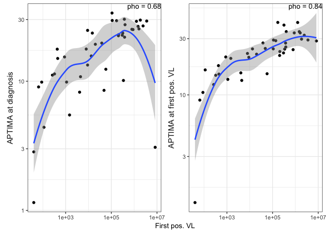

# Setup


```r
library(tidyverse)
```

```
## Registered S3 methods overwritten by 'ggplot2':
##   method         from 
##   [.quosures     rlang
##   c.quosures     rlang
##   print.quosures rlang
```

```
## ── Attaching packages ──────────────────────────────────────────────────────── tidyverse 1.2.1 ──
```

```
## ✔ ggplot2 3.1.1     ✔ purrr   0.3.2
## ✔ tibble  2.1.3     ✔ dplyr   0.8.1
## ✔ tidyr   0.8.3     ✔ stringr 1.4.0
## ✔ readr   1.3.1     ✔ forcats 0.4.0
```

```
## ── Conflicts ─────────────────────────────────────────────────────────── tidyverse_conflicts() ──
## ✖ dplyr::filter() masks stats::filter()
## ✖ dplyr::lag()    masks stats::lag()
```

```r
theme_set(theme_bw())

# num2  keeps APTIMA missing when it didnt have a value 

rv217 = read_csv("../data/RV217Clean.csv") %>%
  mutate(APTIMA_num2 = case_when(
    APTIMA_num == as.numeric(APTIMA) ~ APTIMA_num,
    TRUE ~ NA_real_
  ))
```

```
## Parsed with column specification:
## cols(
##   .default = col_double(),
##   draw_date = col_character(),
##   VLunit = col_character(),
##   posVL = col_logical(),
##   APTIMA = col_character(),
##   VL_site = col_character(),
##   FiebigStage = col_character(),
##   priority = col_character(),
##   site = col_character(),
##   Notes = col_character(),
##   visit_code = col_character(),
##   EIA = col_character(),
##   WB = col_character()
## )
```

```
## See spec(...) for full column specifications.
```

```
## Warning in eval_tidy(pair$lhs, env = default_env): NAs introduced by
## coercion
```

# APTIMA vs. VL


Using the raw data

```r
cor_apt_vl = rv217 %>%
  select(ID, VL, log10VL, APTIMA_num2) %>%
  na.omit() %>% # complete case subsetting but not actually necessary
  mutate(ID = factor(ID)) %>%
  gather(vl_trans, vl, VL, log10VL) %>%
  group_by(vl_trans) %>%
  nest() %>%
  mutate(
    rmcorr_mod = map(data, ~rmcorr::rmcorr(ID, vl, APTIMA_num2, .x)),
    rmcorr_res = map(rmcorr_mod, ~tibble(r = .x$r,pvalue = .x$p, 
                                          CI_lower = .x$CI[1], CI_upper = .x$CI[2])
    )) %>%
  unnest(rmcorr_res)
  

ggplot(data = rv217, aes(x = VL, y = APTIMA_num)) +
  scale_x_log10("VL") +
  scale_y_continuous("APTIMA") +
  geom_point() +
  annotate("text", x = Inf, y = Inf, label = paste0("pho = ", round(cor_apt_vl$r[2], 2)),
           vjust = 1, hjust = 1)
```

```
## Warning: Removed 1148 rows containing missing values (geom_point).
```

<!-- -->


```r
rv217_firstpos = rv217  %>%
  group_by(ID) %>%
  summarize(
    APTIMA_dx = APTIMA_num2[days_dx == 0],
    APTIMA_firstVL = APTIMA_num2[days == 0],
    firstVL = VL[days == 0]
  ) %>%
  gather(APTIMA_time, APTIMA_value, APTIMA_dx, APTIMA_firstVL)

first_pos_cor = rv217_firstpos %>%
  group_by(APTIMA_time) %>%
  nest() %>%
  mutate(
    spearman_cor = map_dbl(data, ~cor(log10(.x$firstVL), .x$APTIMA_value, 
                                       method = "spearman", use = "complete.obs")),
    spearman_p = map_dbl(data, ~coin::pvalue(coin::spearman_test(
      APTIMA_value ~ log10(firstVL), data = .x)))
    )


rv217_firstpos %>%
  ggplot(aes(x = firstVL, y = APTIMA_value)) +
  scale_x_log10("First pos. VL") +
  scale_y_continuous() +
  geom_point() +
  geom_text(data = first_pos_cor, 
            aes(label = paste("pho =", round(spearman_cor, 2)),
                x = Inf, y = Inf, vjust = 1, hjust = 1)) +
  facet_wrap(~APTIMA_time, strip.position = "left", scales = "free_y",
             labeller = as_labeller(c("APTIMA_dx" = "APTIMA at diagnosis",
                                      "APTIMA_firstVL" = "APTIMA at first pos. VL"))) +
  theme(
    axis.title.y = element_blank(),
    strip.placement = "outside",
    strip.background = element_blank(),
    strip.text = element_text(size = 12)
  )
```

```
## Warning: Removed 26 rows containing missing values (geom_point).
```

<!-- -->
